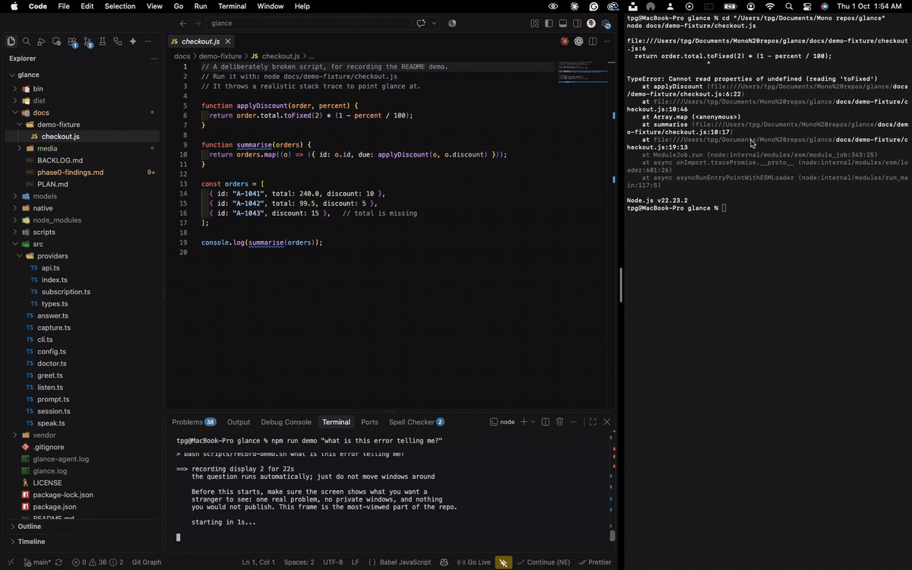

# glance

[](https://github.com/Chamberezigbo/glance/actions/workflows/build.yml)
[](LICENSE)


**Ask your Mac what's on your screen. Out loud, or by typing. Get an answer in seconds.**

Press a key, ask *"what is this error telling me?"*, and glance looks at your
screen once and answers — spoken aloud, or in a small panel beside your cursor.

It does **not** watch continuously. It glances when told to, which is where the
name comes from.



<sub>Real capture: a `TypeError` in a terminal, a question, and the answer in a
panel beside the cursor — about twenty seconds, unedited.</sub>

```
  ⌥Space ──▶ record mic ──▶ whisper.cpp (local) ──┐
             screencapture ──▶ downscale ─────────┤
                                                  ▼
                                            Claude (vision)
                                                  │
                        panel + `say` ◀───────────┘
```

---

## Why it might interest you

Not because screen assistants are novel. Because this one was **measured before
it was built**, and the measurements changed it:

- The plan budgeted **2,500 tokens** per question. Measurement said **59,000** —
  a 24× error, because `claude -p` boots a whole coding agent before it looks at
  the image. The token budget was rewritten from data, not re-estimated.
- A feature to **point at what you should click** was probed and **killed**: the
  model located 1 of 4 targets accurately, with errors of 250–330 real pixels.
  An arrow on the wrong button is worse than no arrow, so it was never built.
- A denied Screen Recording permission **doesn't fail** — macOS hands back your
  wallpaper with no windows in it, and the assistant then describes an empty
  desktop with total confidence. glance now refuses instead.
- Spoken answers run at **~2.9 words/second**, and comma-separated lists drop
  that to **1.9**. So the word cap alone doesn't bound how long an answer takes
  to hear, and the prompt forbids lists outright.

Every number was taken first-hand on a 2017 dual-core i5 under real load. The
workings are in **[docs/phase0-findings.md](docs/phase0-findings.md)**; the
reasoning and what was deliberately *not* built are in
**[docs/PLAN.md](docs/PLAN.md)** and **[docs/BACKLOG.md](docs/BACKLOG.md)**.

## Using it

| | |
|---|---|
| **⌥Space** | ask out loud, hear the answer |
| **⌥⇧Space** | type a question, read the answer |
| `glance "why is this failing?"` | from a terminal |
| **⌥N** | tick the current step, move to the next |
| **⌥⇧N** | look at the screen and check whether the step is actually done |
| **⌥R** | repeat the last answer — or the current step, mid-task |
| `glance --follow "and the one below?"` | follow up without a new screenshot |

Answers match how you asked: **typed gets a panel, spoken gets both.** Someone
typing is already reading the screen and being spoken at is intrusive; someone
speaking has their attention elsewhere — and still gets the panel, because
spoken text can't be re-read.

Follow-ups reuse the screenshot already in the conversation: **30,896 tokens and
12.3s, against 59,584 and 18.5s** for a fresh question. The conversation expires
after five minutes, because an answer about a screen you've navigated away from
isn't slightly stale — it's confident and wrong.

## Big tasks become a checklist

Some answers are instructions, not explanations. Ask *"how do I take this repo
from private to fully open source?"* and glance breaks it into steps, shows the
one you are on, and advances with **⌥N** until the task is done.

```
Step 2 of 5
Scroll to Danger Zone and change visibility from Private to Public
click for all · ⌥N next step
```

Click the panel for the whole checklist. Only genuinely sequential answers — three
or more actions in order — become tasks; *"what is this error?"* stays prose.

**⌥⇧N checks your work.** glance takes a fresh screenshot and judges whether the
current step actually happened, then advances or tells you what is still missing:

> *"Not yet. The screen still shows VS Code and the local project, not a GitHub
> repository page in a browser."*

⌥N is free and instant — it trusts you. ⌥⇧N costs a capture and a round trip, so
it is a separate key rather than something every step quietly pays for.

While a task is running, glance knows where you are. Ask *"how many steps left?"*
and it answers from the task, not the screen.

It costs **no extra tokens**: the steps arrive in the same response as the
answer, so a task-producing question measures the same ~59,000 as any other.

Speech never reads the list out. At 2.9 words/second a six-step checklist is
over a minute of audio, so you hear the summary and the step you are on.

A follow-up keeps your task; a new question replaces it, and says so —
`glance task restore` undoes that.

## When the network misbehaves

| | |
|---|---|
| Slow | After 30s the badge changes and says it is taking longer than usual |
| Hung | Both paths give up after 120s rather than waiting forever |
| Offline | Told plainly, and distinguished from Claude being unreachable |
| Rate limited, 5xx, auth | Each gets its own message and its own fix |
| Anything failed | `glance retry` asks again without retyping or re-speaking it |

Tune with `GLANCE_TIMEOUT_MS` and `GLANCE_SLOW_MS`.

## Two models, one interface

| | Subscription (`claude -p`) | API key |
|---|---|---|
| Per question | ~59,000 tokens | ~1,200 (projected) |
| Latency | 16–18s measured | 2–3s (projected) |
| Cost | none — your Pro/Max plan | ~$0.003 |

Picks the API path when `ANTHROPIC_API_KEY` is set, the subscription otherwise.
`--provider` forces either.

The subscription path's cost is almost entirely agent preamble — system prompt,
tool schemas, settings — not the screenshot, which is ~790 tokens. The lean
flags glance uses cut it from 167,148 tokens and 30s down to 59,000 and 16s, but
~50k is the floor.

## What it deliberately cannot do

glance holds **only Screen Recording and Microphone**. It never asks for
Accessibility or Input Monitoring, so it has no way to read what you type or
control your machine.

That isn't restraint, it's enforced by the permission set. The global hotkey
uses Carbon's `RegisterEventHotKey`, which asks the window server for one
specific chord — unlike a `CGEventTap`, which observes *every* keystroke and is
why most hotkey libraries demand Input Monitoring.

Nothing is stored, indexed, or sent anywhere except the question and one
downscaled frame, to Claude, when you ask.

## Install

macOS 13+, Node 22+, and either a Claude subscription or an `ANTHROPIC_API_KEY`.

```bash
git clone git@github.com:Chamberezigbo/glance.git
cd glance
npm run setup          # deps, build, Swift app, whisper.cpp, models
npm run setup:cert     # stable signing — see below
npm run agent:install  # start at login
glance doctor          # what's missing, with the fix next to each line
```

**Run `setup:cert`.** macOS binds permissions to an app's code signature, and an
ad-hoc signature is a hash of the binary — so every rebuild looks like a new app
and silently revokes Screen Recording and Microphone, while the toggles still
read "on". A stable certificate fixes it. ([Keychain Access → Certificate
Assistant does it in one pass](docs/BACKLOG.md) if the script gives you
trouble.)

## Built on

`claude -p` or the Messages API · [whisper.cpp](https://github.com/ggml-org/whisper.cpp)
`base.en` (2.47s for a 4.5s clip, under load) · `screencapture` · `ffmpeg`
(4× faster than `sips`) · macOS `say` with a Premium voice · Swift menu-bar
daemon · TypeScript on Node 22.

## Status

Phases 0–4 complete and in daily use: typed and spoken questions, hotkeys, the
answer panel, follow-ups, a login greeting, and a menu-bar daemon that starts at
login.

Not done: burst mode, a wake word, and anything needed to ship this to someone
else — signing for distribution, a first-run permissions walkthrough, and
Windows or Linux support. The reasoning for each is in
[docs/BACKLOG.md](docs/BACKLOG.md).

## Not related to `anvil`

A sibling repo. anvil is a coding harness with a local-model router; glance uses
Claude itself. They share no code and solve opposite problems.

## Contributing

Issues and PRs welcome — [CONTRIBUTING.md](CONTRIBUTING.md) first, especially
the three decisions that will not change without a strong argument.
[SECURITY.md](SECURITY.md) sets out exactly what glance can see and what leaves
your machine.

## Licence

MIT.
